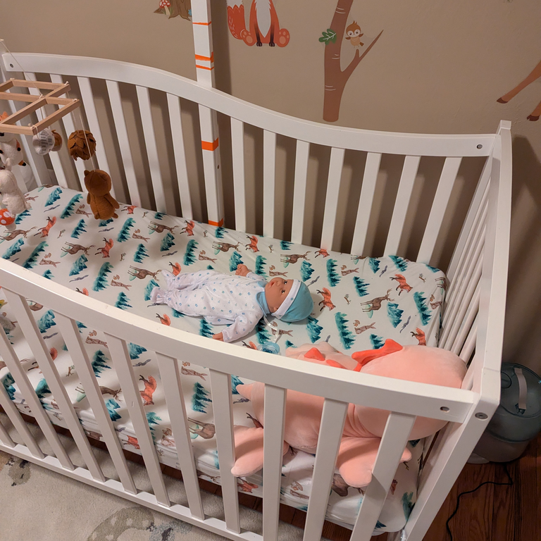
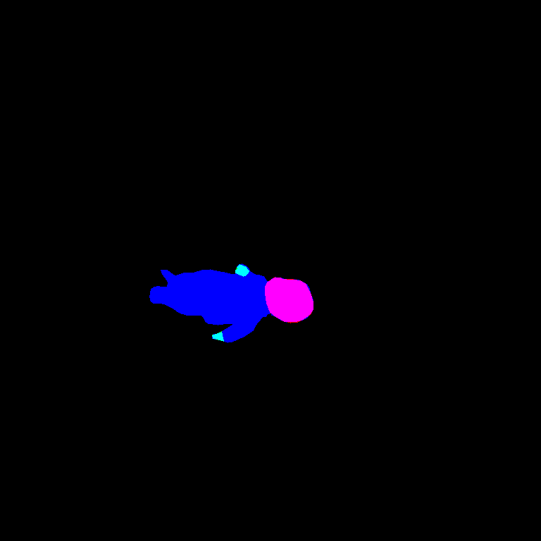
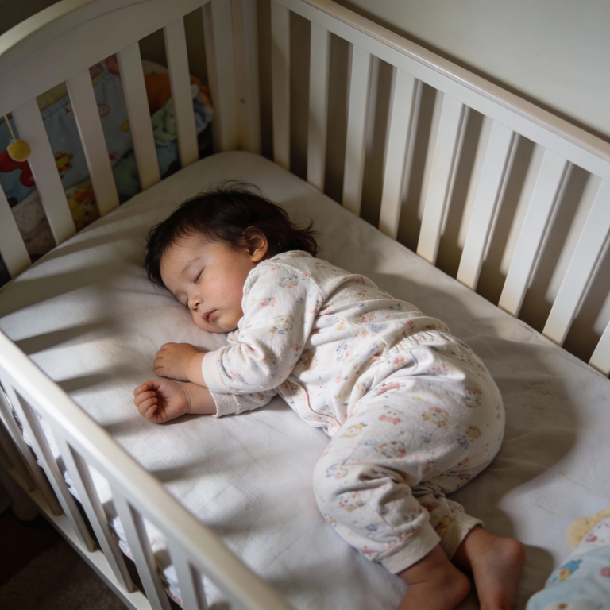
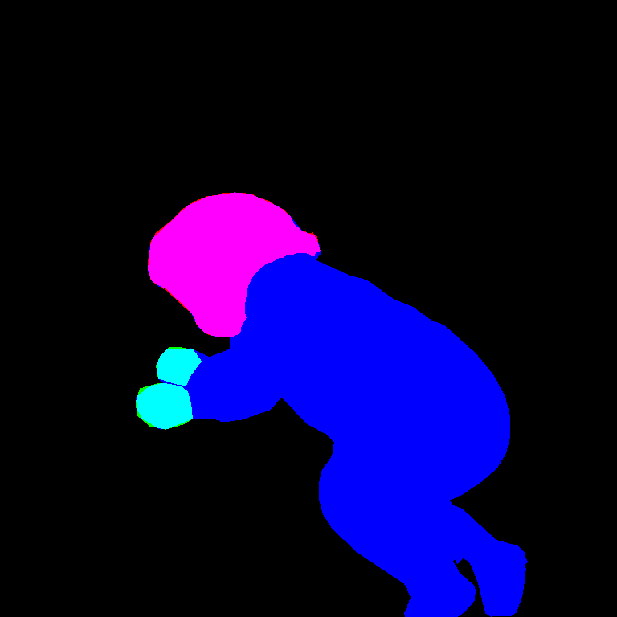

Synthetic Dataset for Infant Detection
======================================

## Overview

This dataset was created to address the challenges of obtaining and using real-world infant data for training computer
vision models, particularly when privacy concerns are paramount. Gathering real images of infants is difficult due to
strict privacy regulations, making it hard to build reliable and diverse datasets for tasks such as infant detection.
Synthetic data, however, allows us to sidestep these issues by providing a safe, scalable alternative for training
models without compromising privacy.

<p align="center">
  
  
  
  
  
  
</p>

Get the data on [Kaggle](https://www.kaggle.com/datasets/tay10r/synthetic-infant-dataset).

## Challenges in Using Real Infant Data

Due to privacy regulations, including GDPR and various child protection laws, it is extremely difficult to obtain real
images of infants for training computer vision models. Even when such data is available, the usage rights are often
limited, making it hard to gather a sufficiently diverse dataset to train robust models. Additionally, the sensitive
nature of infant data requires stringent safeguards, adding further complexity to collecting and using real-world images.

## Synthetic Data Approach

To overcome these challenges, we have created a synthetic dataset generated using path tracing. The dataset is composed
of semi-realistic images that simulate various scenarios with infants in diverse environments. This synthetic approach
ensures that privacy is never compromised, while still providing the necessary data to train machine learning models.

Additionally, we augment the dataset with a collection of real images using a baby doll as a substitute for a real baby,
as well as a set of images generated with [Stable Diffusion](https://stablediffusionweb.com/). These images offer even
more realistic data. However since they are more difficult to annotate, they are a smaller part of the dataset.

### Key Features:

- **Path Traced Images**: All images are rendered using path tracing, ensuring photorealistic quality with accurate lighting and shadows.
- **Randomized Textures**: The textures and colors of the environment, such as furniture, clothing, and backgrounds, are randomized in each sample to increase variability and mimic real-world diversity.
- **Varied Camera Angles**: Each image is captured from a randomized camera angle, providing a wide range of perspectives for robust model training.
- **Privacy-Conscious**: No real infant data is used, ensuring full compliance with privacy regulations and ethical standards.

## Dataset Usage

This dataset can be used for training machine learning models for infant detection, image segmentation, and other
related tasks. The synthetic nature of the dataset ensures that the models are trained with privacy in mind while still
achieving high generalization performance. The recommended approach is to begin training on the procedural path traced
dataset (for one epoch) and then fine tune on the smaller more realistic dataset.

## Generating from Scratch

If you'd like to generate this dataset from scratch, you will need a C++ compiler, CMake and `libgtest-dev` installed
on your system. The code is primarily compiled and tested on Ubuntu, but it could probably run on other platforms such
as Windows with little to no effort.

Enter the project directory with a terminal and run:

```bash
mkdir build
cd build
cmake .. -DCMAKE_BUILD_TYPE=Release
cmake --build .
./main # <- This starts generating the dataset.
```

Have a look in [src/main.cpp](./src/main.cpp) and [src/generator.cpp](./src/generator.cpp) to see how things are
generated and what you may be able to tinker with.

## Pre-generated Dataset

Generating the images takes a really long time and a lot of compute.
You can also download the pre-generated one on the release page on GitHub.

## Limitations

Although the rendering techniques make the lighting look a bit realistic, the generated dataset is still limited by
the take of realistic geometry and textures. The baby model for instance is not entirely realstic since it lacks
accurate clothing and hair. Additionally the rendered images can sometimes look "too perfect" in the sense that there
not enough blemishes in the materials and the image itself does not have the same pixel-wise traits as an image taken
with a real world camera (such as SNR, lens distortion, etc).

The more realistic data included is (as of this writing) about 130 images. While data augmentations make that go a bit
longer, the realistic data is significantly smaller than the procedural data (10k images).

## Reference Model

There is a reference computer vision model for this dataset, optimized for embedded systems.
It is kept in this repo mostly to serve as an example or demo. Check out the `reference_model` directory for the code.

## Related Work

 - [CribNet](https://ieeexplore.ieee.org/document/10581871) along with the dataset CribHD. This work is related to
   detecting objects that may pose a danger to an infant. Their dataset consists of real images with infant CPR manikin.
 - [Invariant Representation Learning for Infant Pose Estimation with Small Data](https://arxiv.org/abs/2010.06100) work
   on pose estimation with a dataset consisting of a small amount of real and synthetic data.
